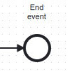

# BPMN нотация.

## Схема Bpmn
 

## Start Event
Начало процесса  
Элемент для обозначения начало процесса  
 
Требования:
1. Один на схеме.
2. Имеет один выход.

## Service Task
Атомарный блок выполннения кода.  
Например, выполняет атомарный кусок логики. 
 
Требования:
1. Имеет один вход.
2. Имеет один выход.

## Send Task
Атомарный блок выполннения кода.  
Конечная цель этого блока отправить сообщения в шину данных.
Сообщения отправляет во внешние брокеры (**движок BpmnDotNet не контролирует жизненный цикл этого сообщения**)

 
Требования:
1. Имеет один вход.
2. Имеет один выход.

## Receive Task
Атомарный блок выполннения кода.  
Конечная цель этого блока дождаться сообщения из внутренней шины данных (задействован BpmnDotNet)

 

Требования:
1. Имеет один вход.
2. Имеет один выход.

## Exclusive Gateway
Эксклюзивный шлюз, предлагает выбрать направление движения алгоритма. 
Количество ветвей не ограниченно.

Требования:  
1. Всегда требует выбора направления движения.
2. На схеме должно быть открывающий шлюз и закрывающий (четное число шлюзов).

## Parallel Gateway
Параллельный шлюз. Запускает несколько ветвей процесса и дожидается их завершения. 
Заблокирует процесс на закрывающем шлюзе до завершения всех входящих ветвей.

Требования: 
1. На схеме должно быть открывающий шлюз и закрывающий (четное число шлюзов).

## Sub process
Дочерний процесс. Запускает субПроцесс.

Требования: 
1. Имеет один вход.
2. Имеет один выход.
3. Ожидание его реализовывать в коде (можно как ожидать завершения, так и продолжить выполнение основного процесса)

## End Event
Окончания процесса  
Элемент для обозначения окончание процесса  
 
Требования:
1. Один на схеме.
2. Имеет один вход.

## Sequence Flow
Это собственно стрелочка от блока к блоку.

