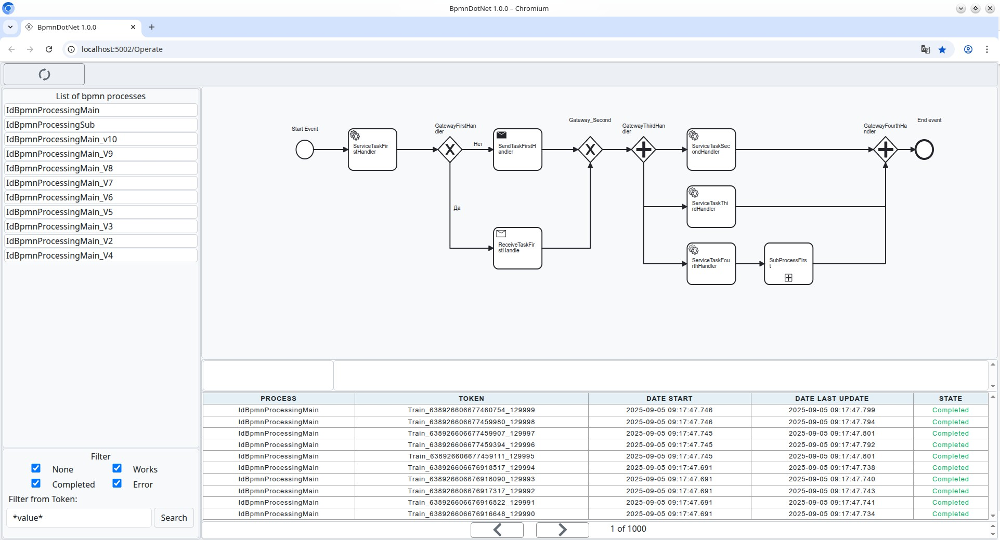
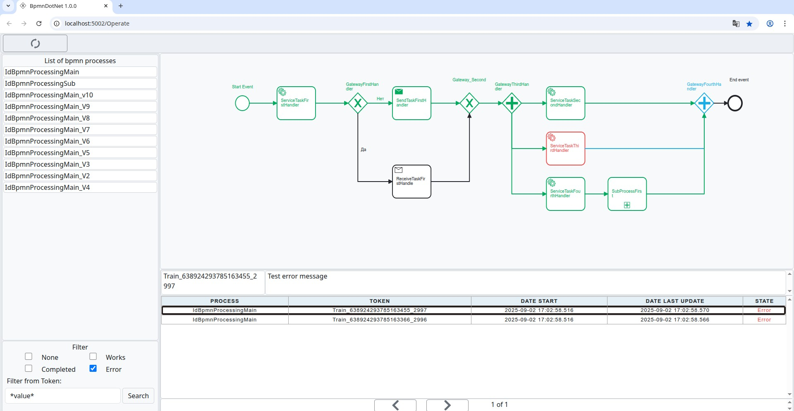

# Визуальная часть.

## Настройка
Для работы сервиса необходимо запустить:
1. [BpmnDotNet.ElasticClient](../BpmnDotNet/BpmnDotNet.ElasticClient/READMI.md)
2. [BpmnDotNet.Arm.Web](../BpmnDotNet/BpmnDotNet.Arm.Web/README.MD)

## Визуализация выбранной схемы
 

## Визуализация выбранного процесса
 

Веб интерфейс протестирован на chromium browser.